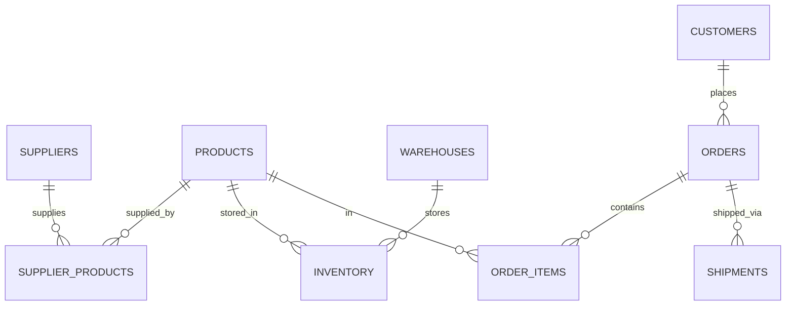

# Supply Chain Management Database Design Document

## Purpose

The purpose of this database is to provide a comprehensive system for managing supply chain operations in a manufacturing or retail company. It tracks suppliers, products, inventory levels across multiple warehouses, customer orders, and shipments. The database aims to optimize procurement processes, minimize stockouts, ensure timely deliveries, and provide insights into supply chain efficiency. By centralizing this information, the system helps decision-makers reduce costs, improve customer satisfaction, and maintain optimal inventory levels.

## Scope

This database covers the core aspects of supply chain management including supplier management, product cataloging, inventory tracking, order processing, and shipment logistics. It supports multiple warehouses, various product categories, and handles customer orders from placement to delivery. The scope includes:

- Managing supplier information and their product offerings
- Tracking product details and availability
- Monitoring inventory levels across different warehouse locations
- Processing customer orders and order fulfillment
- Tracking shipment status and delivery information

The database does not include financial accounting, advanced analytics, or integration with external systems like ERP software. It focuses on operational data rather than financial transactions.

## Entities

### Suppliers
- **id** (Primary Key): Unique identifier for each supplier
- **name**: Supplier's company name
- **contact_email**: Email address for communication
- **location**: Geographic location of the supplier

### Products
- **id** (Primary Key): Unique identifier for each product
- **name**: Product name
- **description**: Detailed description of the product
- **category**: Product category (e.g., electronics, clothing, food)

### SupplierProducts
- **supplier_id** (Foreign Key to Suppliers): References the supplier
- **product_id** (Foreign Key to Products): References the product
- **price**: Price per unit from this supplier
- **lead_time**: Time in days to receive products from this supplier

### Warehouses
- **id** (Primary Key): Unique identifier for each warehouse
- **location**: Geographic location of the warehouse

### Inventory
- **warehouse_id** (Foreign Key to Warehouses): References the warehouse
- **product_id** (Foreign Key to Products): References the product
- **quantity**: Current stock quantity of the product in the warehouse

### Customers
- **id** (Primary Key): Unique identifier for each customer
- **name**: Customer's name
- **contact_email**: Email address for communication

### Orders
- **id** (Primary Key): Unique identifier for each order
- **customer_id** (Foreign Key to Customers): References the customer who placed the order
- **order_date**: Date when the order was placed

### OrderItems
- **order_id** (Foreign Key to Orders): References the order
- **product_id** (Foreign Key to Products): References the product ordered
- **quantity**: Quantity of the product ordered

### Shipments
- **id** (Primary Key): Unique identifier for each shipment
- **order_id** (Foreign Key to Orders): References the order being shipped
- **shipment_date**: Date when the shipment was sent
- **status**: Current status of the shipment (e.g., pending, shipped, delivered)

## Relationships

- **Suppliers to Products**: Many-to-many relationship through SupplierProducts. A supplier can provide multiple products, and a product can be supplied by multiple suppliers.
- **Products to Warehouses**: Many-to-many relationship through Inventory. Products can be stored in multiple warehouses, and warehouses can store multiple products.
- **Customers to Orders**: One-to-many relationship. A customer can place multiple orders, but each order belongs to one customer.
- **Orders to OrderItems**: One-to-many relationship. An order can contain multiple items, but each item belongs to one order.
- **Orders to Shipments**: One-to-many relationship. An order can have multiple shipments (e.g., partial deliveries), but each shipment belongs to one order.
- **Products to OrderItems**: Many-to-one relationship. Multiple order items can reference the same product.

## Optimizations

To ensure efficient query performance, the following optimizations have been implemented:

- **Indexes on Foreign Keys**: Indexes created on all foreign key columns (supplier_id, product_id, warehouse_id, customer_id, order_id) to speed up joins and lookups.
- **Composite Primary Keys**: Used where appropriate (e.g., SupplierProducts, Inventory, OrderItems) to enforce uniqueness and improve query performance.
- **Views for Common Queries**: Created views for frequently accessed data, such as low inventory alerts and order summaries.
- **Data Types**: Used appropriate data types (INTEGER for IDs and quantities, TEXT for strings, DATE for dates) to minimize storage and improve performance.

## Limitations

While this database provides a solid foundation for supply chain management, it has several limitations:

- **Currency**: Assumes all prices are in a single currency; no support for multiple currencies or exchange rates.
- **Quantities**: Uses integer quantities; no support for fractional units or different units of measure.
- **Locations**: Stores locations as simple text strings; no geographic coordinates or detailed address information.
- **User Management**: No built-in user authentication or role-based access control.
- **Real-time Updates**: Does not support real-time inventory updates or automatic reorder triggers.
- **Scalability**: Designed for small to medium-sized operations; may require partitioning for very large datasets.
- **Audit Trail**: No automatic logging of changes for compliance or debugging purposes.

## Entity Relationship Diagram

