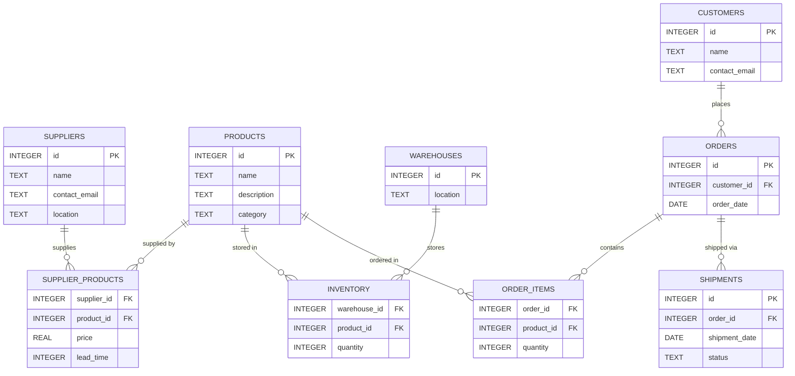

# Supply Chain Management Database

By Jorn van Schagen

## Video Overview

[Video Overview](https://youtu.be/AdI5wwnOlfk)

## Purpose

The purpose of this database is to provide a comprehensive system for managing supply chain operations in a manufacturing or retail company. It tracks suppliers, products, inventory levels across multiple warehouses, customer orders, and shipments. The database aims to optimize procurement processes, minimize stockouts, ensure timely deliveries, and provide insights into supply chain efficiency. By centralizing this information, the system helps decision-makers reduce costs, improve customer satisfaction, and maintain optimal inventory levels.

I chose supply chain management as the domain for this project because it is a real-world problem that directly benefits from relational database design. In practice, supply chain data is often scattered across spreadsheets, emails, and disconnected systems. A well-structured database brings all of this operational data into one place, making it queryable, consistent, and reliable. The relationships between suppliers, products, warehouses, and customers are naturally relational, which makes SQL an excellent fit for modeling and querying this domain.

## Scope

This database covers the core aspects of supply chain management including supplier management, product cataloging, inventory tracking, order processing, and shipment logistics. It supports multiple warehouses, various product categories, and handles customer orders from placement to delivery. The scope includes:

- Managing supplier information and their product offerings
- Tracking product details and availability
- Monitoring inventory levels across different warehouse locations
- Processing customer orders and order fulfillment
- Tracking shipment status and delivery information

The database does not include financial accounting, advanced analytics, or integration with external systems like ERP software. It focuses on operational data rather than financial transactions. I deliberately kept the scope focused on the operational core of a supply chain rather than expanding into areas like invoicing or payroll, because those domains introduce complexity that would detract from the clarity of the relational model. By keeping the scope tight, the database remains practical and easy to reason about while still being complex enough to demonstrate meaningful SQL design patterns like many-to-many relationships, junction tables, and aggregation views.

## Entities

The database is composed of nine entities, each representing a distinct concept within the supply chain. I chose to separate these entities rather than combining them into fewer, wider tables, because normalization reduces data redundancy and ensures that updates to one record (for example, a supplier's contact email) propagate consistently without the risk of anomalies.

### Suppliers

The `suppliers` table stores information about the companies that provide products. Each supplier has a unique `id`, a `name`, a `contact_email` for communication, and a `location` representing their geographic region. I included `contact_email` as a direct attribute rather than creating a separate contacts table, because in this scope each supplier has a single point of contact.

- **id** (Primary Key): Unique identifier for each supplier
- **name**: Supplier's company name
- **contact_email**: Email address for communication
- **location**: Geographic location of the supplier

### Products

The `products` table catalogs all items that flow through the supply chain. Each product has a `name`, a `description` for details, and a `category` to support filtering and grouping. I chose to store the category as a text field rather than a separate lookup table, because the number of categories is small and the simplicity outweighs the minor denormalization.

- **id** (Primary Key): Unique identifier for each product
- **name**: Product name
- **description**: Detailed description of the product
- **category**: Product category (e.g., electronics, clothing, food)

### SupplierProducts

The `supplier_products` table is a junction table that resolves the many-to-many relationship between suppliers and products. A single product can be sourced from multiple suppliers at different prices and lead times, and a single supplier can provide many different products. I included `price` and `lead_time` as attributes on this junction table (rather than on the product itself), because these values are specific to the supplier-product combination — the same product may cost differently depending on which supplier provides it.

- **supplier_id** (Foreign Key to Suppliers): References the supplier
- **product_id** (Foreign Key to Products): References the product
- **price**: Price per unit from this supplier
- **lead_time**: Time in days to receive products from this supplier

### Warehouses

The `warehouses` table represents physical storage locations. I kept this table minimal with just an `id` and `location`, because the primary purpose is to serve as a reference for inventory records. In a more complex system, additional attributes like capacity or manager would be relevant, but for this scope, simplicity is preferred.

- **id** (Primary Key): Unique identifier for each warehouse
- **location**: Geographic location of the warehouse

### Inventory

The `inventory` table tracks how much of each product is stored in each warehouse. It uses a composite primary key of `warehouse_id` and `product_id` to enforce that each product appears at most once per warehouse. I chose a composite key here instead of a surrogate `id` column because the combination of warehouse and product is inherently unique and serves as a natural key.

- **warehouse_id** (Foreign Key to Warehouses): References the warehouse
- **product_id** (Foreign Key to Products): References the product
- **quantity**: Current stock quantity of the product in the warehouse

### Customers

The `customers` table stores information about the people or businesses placing orders. Similar to suppliers, each customer has a `name` and `contact_email`. I structured customers and suppliers as separate tables even though they share similar columns, because they play fundamentally different roles in the supply chain and may evolve independently in future versions of the schema.

- **id** (Primary Key): Unique identifier for each customer
- **name**: Customer's name
- **contact_email**: Email address for communication

### Orders

The `orders` table records each customer order. It references the customer who placed it and stores the `order_date`. I chose to keep orders separate from order items so that metadata about the order (like the date and customer) is stored once, while the individual products and quantities are stored in a related table. This avoids repeating order-level information for every item.

- **id** (Primary Key): Unique identifier for each order
- **customer_id** (Foreign Key to Customers): References the customer who placed the order
- **order_date**: Date when the order was placed

### OrderItems

The `order_items` table is a junction table between orders and products. Each row records that a specific product was ordered in a specific quantity as part of a specific order. The composite primary key of `order_id` and `product_id` ensures that the same product cannot appear twice in the same order — instead, the quantity should be adjusted.

- **order_id** (Foreign Key to Orders): References the order
- **product_id** (Foreign Key to Products): References the product ordered
- **quantity**: Quantity of the product ordered

### Shipments

The `shipments` table tracks the delivery status of each order. An order can have multiple shipments to support partial deliveries. The `status` field defaults to `'pending'` and can be updated as the shipment progresses through stages like `'shipped'` and `'delivered'`. I chose to use a text field for status rather than a boolean, because there are more than two possible states in a real shipping workflow.

- **id** (Primary Key): Unique identifier for each shipment
- **order_id** (Foreign Key to Orders): References the order being shipped
- **shipment_date**: Date when the shipment was sent
- **status**: Current status of the shipment (e.g., pending, shipped, delivered)

## Relationships

The relationships between entities were designed to reflect real-world supply chain dynamics as closely as possible within a relational model.

- **Suppliers to Products**: Many-to-many relationship through `supplier_products`. A supplier can provide multiple products, and a product can be supplied by multiple suppliers. This is one of the most important design decisions in the schema, because it allows the system to compare pricing and lead times across different suppliers for the same product.
- **Products to Warehouses**: Many-to-many relationship through `inventory`. Products can be stored in multiple warehouses, and warehouses can store multiple products. This reflects the reality that companies distribute inventory across multiple locations for redundancy and faster delivery.
- **Customers to Orders**: One-to-many relationship. A customer can place multiple orders, but each order belongs to one customer.
- **Orders to OrderItems**: One-to-many relationship. An order can contain multiple items, but each item belongs to one order. This separation keeps order metadata (date, customer) distinct from line-item details (product, quantity).
- **Orders to Shipments**: One-to-many relationship. An order can have multiple shipments (e.g., partial deliveries), but each shipment belongs to one order.
- **Products to OrderItems**: Many-to-one relationship. Multiple order items can reference the same product, allowing the database to track how often each product is ordered.

## Optimizations

To ensure efficient query performance, the following optimizations have been implemented. Each was chosen based on the types of queries that a supply chain manager would run most frequently.

- **Indexes on Foreign Keys**: Indexes have been created on all foreign key columns (`supplier_id`, `product_id`, `warehouse_id`, `customer_id`, `order_id`) to speed up JOIN operations. Without these indexes, the database would need to perform full table scans every time two tables are joined, which becomes increasingly slow as data grows. Since nearly every useful query in this schema involves at least one JOIN, indexing foreign keys was the highest-impact optimization available.
- **Composite Primary Keys**: Used on junction tables (`supplier_products`, `inventory`, `order_items`) to enforce uniqueness and serve as implicit indexes. This was preferred over adding a surrogate `id` column because the composite key naturally prevents duplicate entries and SQLite automatically creates an index on the primary key.
- **Views for Common Queries**: Two views were created to encapsulate complex queries that would be run repeatedly. The `low_inventory` view flags any product-warehouse combination with fewer than 10 units in stock, which is a critical alert for operations. The `order_summaries` view aggregates order data (item count and total quantity) so that managers can quickly review order activity without writing a multi-table JOIN and GROUP BY each time.
- **Data Types**: Appropriate data types were selected to minimize storage while maintaining accuracy. `INTEGER` is used for IDs and quantities, `REAL` for prices (which may have decimal values), `TEXT` for names and descriptions, and `DATE` for temporal data.

## Limitations

While this database provides a solid foundation for supply chain management, it has several limitations that should be understood:

- **Currency**: All prices are assumed to be in a single currency. There is no support for multiple currencies or exchange rate conversions, which would be necessary for international supply chains.
- **Quantities**: The schema uses integer quantities only. There is no support for fractional units (e.g., 2.5 kilograms) or different units of measure, which limits applicability for certain product types.
- **Locations**: Locations are stored as simple text strings. There are no geographic coordinates, structured address fields, or spatial queries, which limits the ability to perform distance-based routing or mapping.
- **User Management**: There is no built-in user authentication or role-based access control. In a production environment, different users (e.g., warehouse staff vs. procurement managers) would need different levels of access.
- **Real-time Updates**: The database does not support real-time inventory updates or automatic reorder triggers. Stock levels must be updated manually through explicit UPDATE queries.
- **Scalability**: The schema is designed for small to medium-sized operations. Very large datasets may require table partitioning, read replicas, or migration to a more scalable database system.
- **Audit Trail**: There is no automatic logging of changes. In a regulated industry, an audit trail recording who changed what and when would be essential for compliance.

## Entity Relationship Diagram

